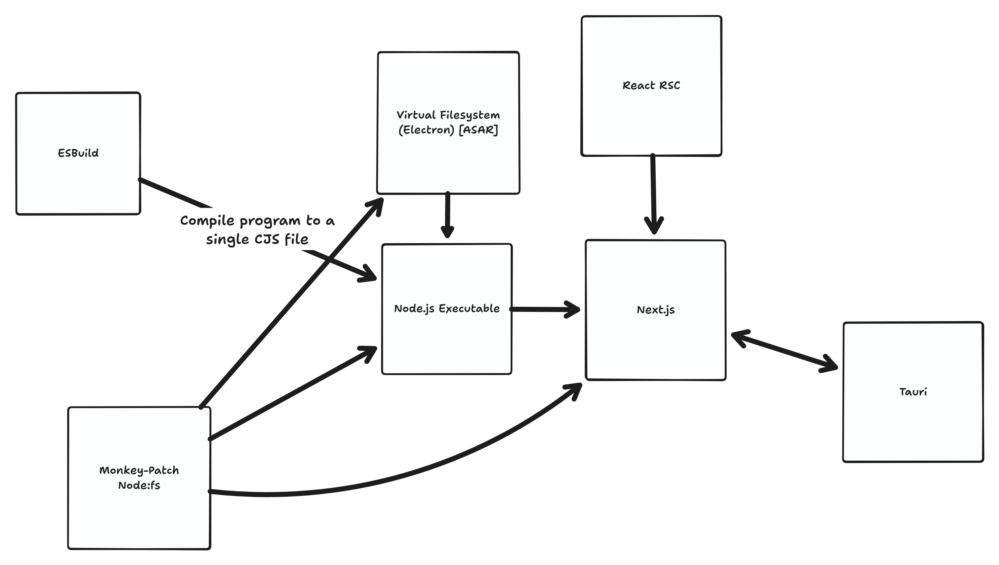

# Tauri + React RSC Exploration

> **This is a bad idea that should not be used in production**.

What if we could get Next.js' SSR mode running in Tauri as a sidecar? That would allow us to use React's RSC mechanisms in our apps,
which could serve interestingly.

## Architecture Diagram

> This isn't a great visual explainer. I wrote it quickly [while live on Twitch](https://twitch.tv/crutchcorn).
