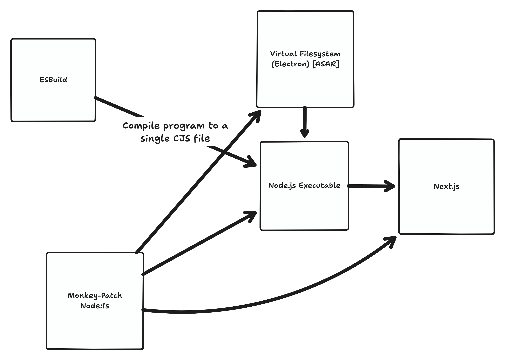

# Next.js.exe

> **This is a bad idea that should not be used in production**.

This is a proof of concept for running the Next.js dev server as a single executable that contains all of the assets and code needed to run the server,
including RSC support.

## Architecture Diagram

> This isn't a great visual explainer. I wrote it quickly [while live on Twitch](https://twitch.tv/crutchcorn).

## Unfinished Warning

This project is _mostly_ finished but is not tested, as we are blocked by this issue:

https://github.com/nodejs/single-executable/issues/100

### Will it work?

I'm not sure, because our `fs` patch supposedly can read from `Buffer`s like `sea.getAsset` returns, however this **really heavily** expects
Next.js to not introspect the `dir` path as if it were a string in any way outside of using the `fs` APIs. I'm doubtful this is the case, but I could be wrong.
